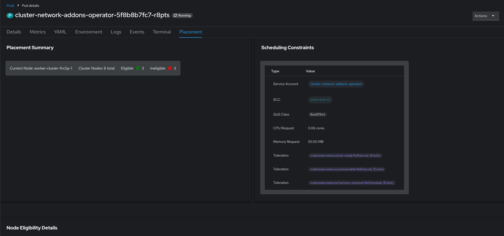
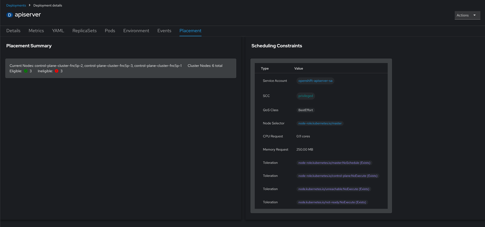
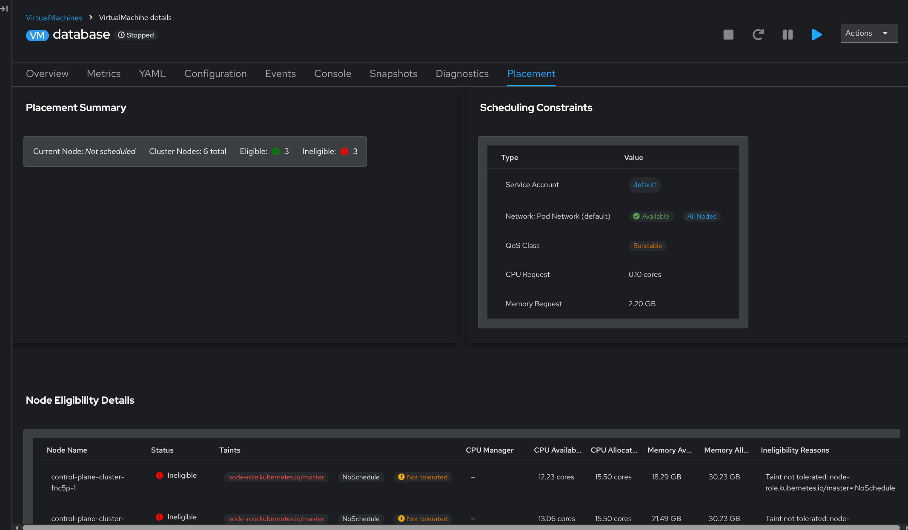

# Placement Discovery Plugin for OpenShift Console

An OpenShift Console dynamic plugin that adds a **Placement** tab to Pods, Deployments, and VirtualMachines. It analyzes the Kubernetes scheduler's perspective for a workload and presents it visually — showing where workloads are running, which nodes are eligible, and why certain nodes are ineligible.

## What Does It Do?

When you're troubleshooting why a Pod isn't scheduled, figuring out which nodes a Deployment can run on, or understanding the placement constraints of a VirtualMachine, the information is scattered across `oc describe`, node labels, taints, resource capacity, and network configurations. This plugin brings it all together in a single view inside the OpenShift Console.

Once installed, a **Placement** tab appears on the detail pages of:

- **Pods** — Navigate to **Workloads > Pods**, select a pod, and click the **Placement** tab
- **Deployments** — Navigate to **Workloads > Deployments**, select a deployment, and click the **Placement** tab
- **VirtualMachines** — Navigate to **Virtualization > VirtualMachines**, select a VM, and click the **Placement** tab

The tab shows:

- **Placement Summary** — Which node(s) the workload is currently running on, total cluster nodes, and how many are eligible or ineligible
- **Scheduling Constraints** — The workload's service account, SCC, QoS class, CPU and memory requests, node selectors, and tolerations at a glance
- **Network Information** (VMs only) — Which networks the VM uses (pod network, Multus, SR-IOV), whether each network is available on all nodes, and exactly which nodes have it
- **Node Eligibility Details** — A per-node table showing taints, CPU/memory capacity and availability, CPU manager status, and the specific reasons a node is ineligible (e.g. "Taint not tolerated: node-role.kubernetes.io/master=:NoSchedule")

## Quick Start

### Prerequisites

- OpenShift 4.14+
- `oc` CLI installed and authenticated with cluster-admin
- `helm` v3+
- For VM support: OpenShift Virtualization (KubeVirt) installed

### 1. Install with Helm

The plugin image is available at `quay.io/kborup/placement-discovery-plugin`.

```bash
helm install placement-discovery-plugin ./charts/placement-discovery-plugin \
  --namespace openshift-console \
  --create-namespace
```

### 2. Enable the Plugin

```bash
oc patch consoles.operator.openshift.io cluster --type=merge \
  --patch '{"spec":{"plugins":["placement-discovery-plugin"]}}'
```

Wait for the console pods to restart (this happens automatically):

```bash
oc rollout status deployment/console -n openshift-console --timeout=120s
```

### 3. Verify

```bash
# Check the plugin pod is running
oc get pods -n openshift-console -l app.kubernetes.io/name=placement-discovery-plugin

# Check the plugin is enabled
oc get consoles.operator.openshift.io cluster -o jsonpath='{.spec.plugins}'
```

Navigate to any Pod, Deployment, or VirtualMachine in the OpenShift Console — the **Placement** tab will appear in the horizontal navigation.

## Uninstalling

```bash
# Remove the plugin from the console
oc get consoles.operator.openshift.io cluster -o json | \
  jq '.spec.plugins = (.spec.plugins // [] | map(select(. != "placement-discovery-plugin")))' | \
  oc apply -f -

# Uninstall the Helm release
helm uninstall placement-discovery-plugin -n openshift-console
```

## Building from Source

If you want to build and deploy your own image instead of using the pre-built one from quay.io, follow these steps.

### Requirements

- Go 1.20+
- Node.js 18+
- npm
- Podman or Docker
- **Red Hat registry login** — The Dockerfile uses Red Hat UBI base images (`registry.redhat.io/ubi9/nodejs-20`, `registry.redhat.io/ubi9/go-toolset`, `registry.redhat.io/ubi9/ubi-minimal`). You must authenticate with the Red Hat container registry before building:
  ```bash
  podman login registry.redhat.io
  ```
  A free Red Hat account can be created at [access.redhat.com](https://access.redhat.com).

### Build and Push

```bash
# Build the container image
make image-build

# Push to your registry
make image-push REGISTRY=quay.io REPOSITORY=youruser/placement-discovery-plugin TAG=0.2.0
```

### Install Your Custom Build

```bash
make install \
  REGISTRY=quay.io \
  REPOSITORY=youruser/placement-discovery-plugin \
  TAG=0.2.0

make enable-plugin
```

### Local Development

```bash
# Terminal 1: Run the Go backend
make dev-backend

# Terminal 2: Watch frontend for changes
make dev-frontend
```

### Make Targets

| Target | Description |
|--------|-------------|
| `make build` | Build backend and frontend |
| `make build-backend` | Build Go binary |
| `make build-frontend` | Build frontend assets |
| `make test` | Run Go tests and frontend type check |
| `make fmt` | Format Go code |
| `make vet` | Run go vet |
| `make lint` | Run frontend linter |
| `make image-build` | Build container image |
| `make image-push` | Push container image |
| `make install` | Install with Helm |
| `make uninstall` | Uninstall Helm release |
| `make verify` | Check deployment status |
| `make logs` | Tail plugin logs |
| `make clean` | Remove build artifacts |

## Architecture

```
placement-discovery-plugin/
├── cmd/plugin/main.go                 # Go HTTP server (port 9002)
├── pkg/
│   ├── handlers/placement.go          # REST API handlers
│   ├── kubernetes/client.go           # Kubernetes client with KubeVirt support
│   ├── models/placement.go            # Data models
│   └── placement/
│       ├── calculator.go              # Node eligibility calculation
│       └── vm_placement.go            # VM-specific placement logic
├── web/
│   ├── src/
│   │   ├── components/PlacementTopology/
│   │   │   ├── PlacementTopology.tsx  # Main UI component
│   │   │   ├── PodTab.tsx             # Pod tab entry point
│   │   │   ├── DeploymentTab.tsx      # Deployment tab entry point
│   │   │   └── VMTab.tsx              # VirtualMachine tab entry point
│   │   ├── hooks/usePlacementData.ts  # Data fetching hook
│   │   └── utils/formatters.ts        # Display formatting utilities
│   ├── webpack.config.ts              # Webpack module federation config
│   └── package.json
├── charts/placement-discovery-plugin/ # Helm chart
├── Dockerfile                         # Multi-stage build
└── Makefile
```

The plugin consists of two parts:

- **Backend**: A Go HTTP server that queries the Kubernetes API to analyze node eligibility for a given workload. It evaluates node selectors, node affinity, taints/tolerations, resource capacity, and (for VMs) network attachment availability via Multus NetworkAttachmentDefinitions and SR-IOV network node states.
- **Frontend**: A React/TypeScript UI registered as an OpenShift Console dynamic plugin via webpack module federation. It adds a "Placement" tab to resource detail pages and displays the backend's analysis using PatternFly components.

### API Endpoints

| Endpoint | Description |
|----------|-------------|
| `GET /api/placement/pod/{namespace}/{name}` | Pod placement analysis |
| `GET /api/placement/deployment/{namespace}/{name}` | Deployment placement analysis |
| `GET /api/placement/vm/{namespace}/{name}` | VirtualMachine placement analysis |
| `GET /health` | Health check |
| `GET /ready` | Readiness probe |

## Contributing

Contributions are welcome! Please use GitHub issues and pull requests.

- **Report bugs** — Open an [issue](https://github.com/kborup-redhat/placement-discovery-plugin/issues) with steps to reproduce
- **Request features** — Open an [issue](https://github.com/kborup-redhat/placement-discovery-plugin/issues) describing the use case
- **Submit changes** — Fork the repo, create a branch, and open a [pull request](https://github.com/kborup-redhat/placement-discovery-plugin/pulls)

When submitting a pull request:
- Ensure `make build` and `make test` pass
- Follow existing code style and conventions
- Include a clear description of what the change does and why

## License

Apache License 2.0 — see [LICENSE](LICENSE) for details.

## Screenshots

### Pod Placement
Shows the current node, scheduling constraints (service account, SCC, QoS class, resource requests, tolerations), and node eligibility across the cluster.



### Deployment Placement
Displays placement across all replica nodes with the same constraint and eligibility analysis.



### VirtualMachine Placement
Includes VM-specific details such as network availability (Multus/SR-IOV), per-node network status, and node eligibility with detailed resource and taint information.


